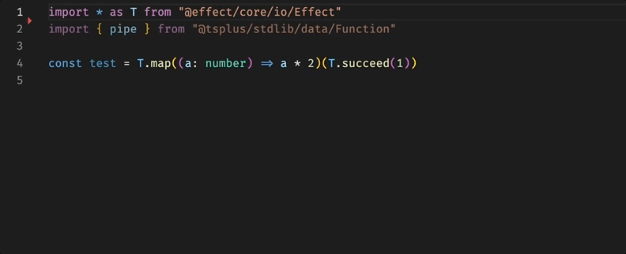
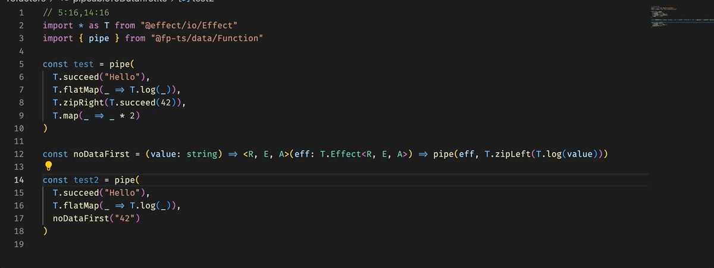
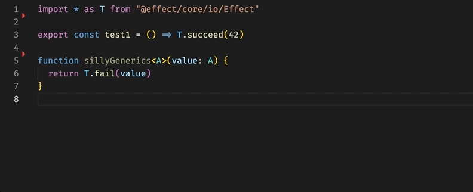
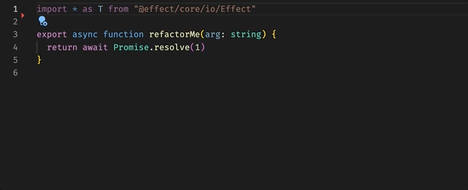

# language-service

This package implements a TypeScript language service plugin that allows additional refactors and diagnostics with your VSCode editor (or any editor that supports TypeScript's LSP).

## Installation

After `npm install @effect/language-service` in your project, ensure you set your VSCode to use your workspace TypeScript version.

Inside your tsconfig.json, you should add the plugin configuration as follows:

```json
{
  "compilerOptions": {
    "plugins": [
      {
        "name": "@effect/language-service"
      }
    ]
  }
}
```

## Provided refactors

Here's a list of the refactors provided by this language service plugin.

### Add pipe



Transform a set of function calls to a pipe() call.

### Pipeable to DataFirst



Transform a pipe() call into a series of datafirst function calls (where available).

Removes useless arrow functions.

### Toggle type annotation



With a single refactor, adds or removes type annotations from the definition.

### async-await to Effect.gen



Transform an async function definition, into an Effect by using Effect.gen.

### async-await to Effect.gen with tryPromise


Transform an async function definition, into an Effect by using Effect.gen, and generating a tagged error for each promise call.
